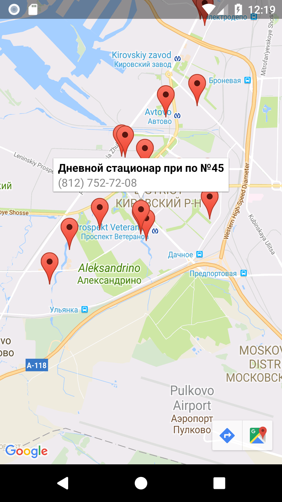

# Запись к врачу по ОМС в Санкт-Петербурге (Android)

Android Design Support library has been released and samples are coming up all over the place.
This sample is bringing Material Design implementation using Android Design Support Library.

## Introduction

Material design is a new system for visual, interaction and motion design. We
launched Android Design Support Library to apply material design to your App.
This sample app demonstrates app using Android Design Support Library.
[Android Developers
blog](http://android-developers.blogspot.se/2015/05/android-design-support-library.html)

### Screenshots





## Support


### License


```
Copyright 2017 mobiskif.


```
